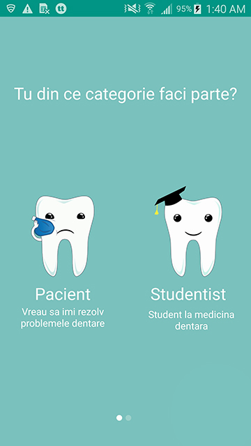
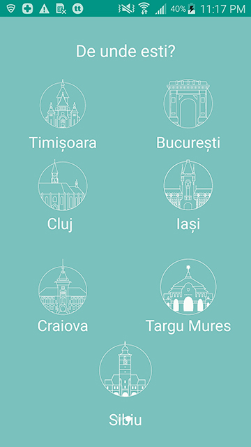
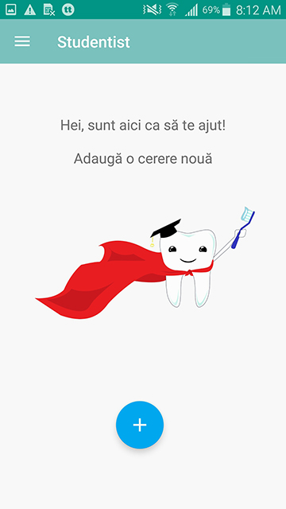
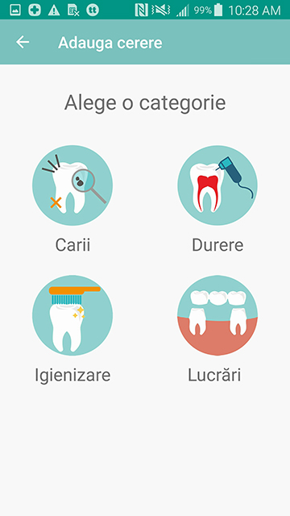
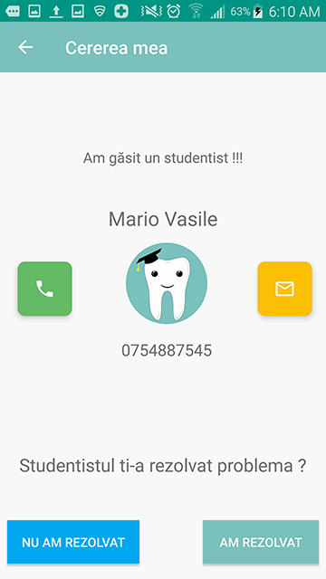
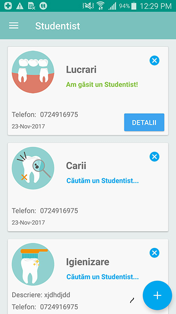

# Studentist 

Studentist is a mobile application which connects people from Romania with students from dental Universities. 
Students from Romania are allowed in some universities to work on patients. Studentist connects people with dental problems with students from dental universities who are allowed to work on patients. 

The app supports two types of users: Patients and Studentists

Studentist is available in 7 cities from Romania: Timisoara, Bucuresti, Cluj, Iasi, Targu Mures, Sibiu, Craiova

Patients can make a request based on 4 categories: Pain, Dental Cleaning, Dental Cavities, Dental Prosthesis. 
Once the patient made a request, all the students from the same city as the patient will receive a notification that a new request was added. The early bird catches the worm, so only the first student will be able to take the request and contact the patient. The application will provide the phone number of the patient to the students and vice versa.

## Get it for Android or iOS
* [Android](https://play.google.com/store/apps/details?id=com.mario22gmail.vasile.studentist) - Get it from PlayStore
* [iOS](https://itunes.apple.com/us/app/studentist/id1349965414?mt=8) - Get it from AppStore

## Deployment

If you want to deploy this on your own. You need to create a firebase subscription and add the google.plist to the project. That's it.

## Built With

* [Firebase](https://firebase.google.com/) - The web framework used
* [Gradle](https://gradle.org/) - Dependency Management

## Login

* [Google](https://.google.com/)
* [Facebook](https://facebook.com/) 

## Contributing

Please feel free to contribute for this project

## Versioning
1.0 First version 
1.1 Fixed minor bugs 
1.2 Added new cities Bucuresti, Iasi, Cluj, 

## Screenshoots

## Authors

* **Mario Vasile** - *Mobile application developer* 
* **Ana Maria Moldovan** - *Graphics designer*

## License

This project is licensed under the MIT License - see the [LICENSE.md](LICENSE.md) file for details

## Acknowledgments

* [Butterknife](http://jakewharton.github.io/butterknife/)
* [AppIntro](https://github.com/apl-devs/AppIntro)
* [FirebaseUI](https://github.com/firebase/FirebaseUI-Android)
